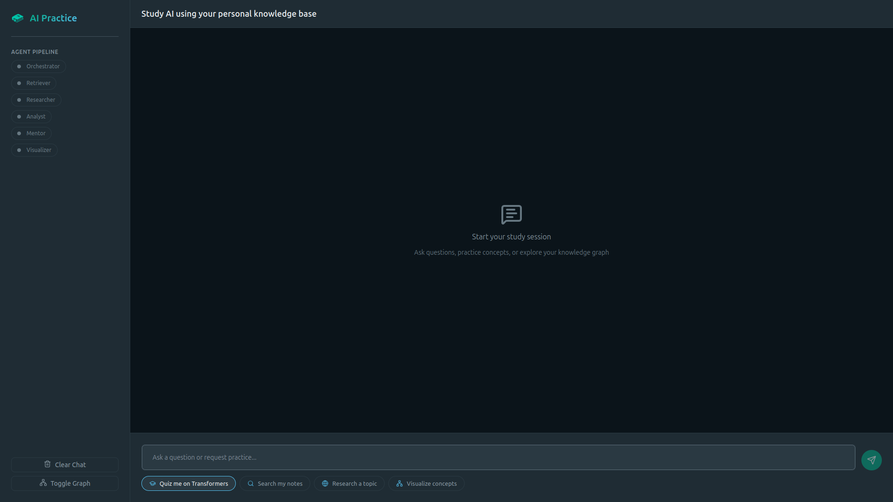
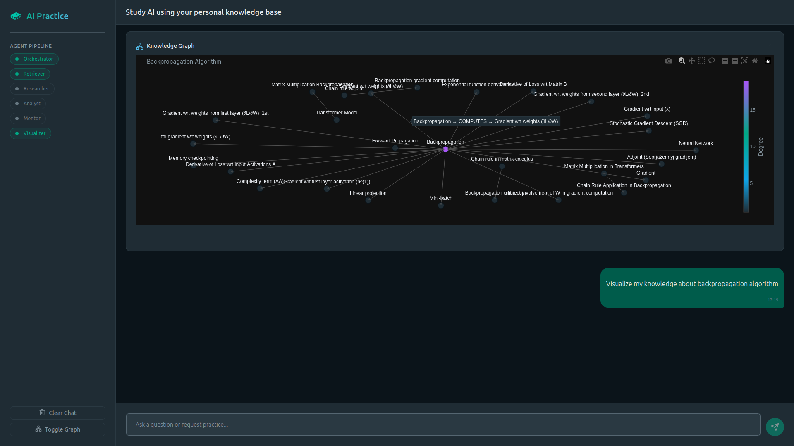
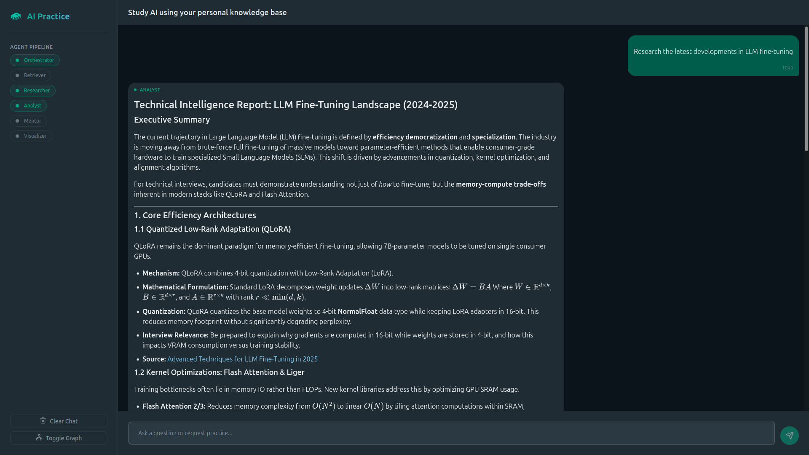
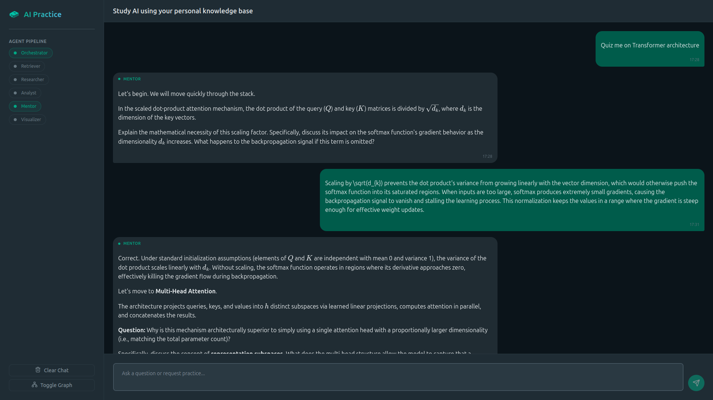

# RemNote Graph RAG | AI Practice System

An AI practice and learning system that combines knowledge graph with multi-agent workflows to help you master technical
concepts through interactive learning, research, and visualization.

## Overview

This project combines a backend powered by LLM with an interactive Reflex web frontend. It is built on a
personal [RemNote](https://www.remnote.com) knowledge base through the creation of a knowledge graph, which is used for
querying information and visualizing data. Internal personal knowledge can also be expanded through external web
research.

## Architecture

### Backend

The backend is built on a multi-agent workflow architecture powered
by [LangGraph](https://github.com/langchain-ai/langgraph)
and [LlamaIndex](https://developers.llamaindex.ai/python/framework/). The following agents are currently implemented:

- **Orchestrator**: Routes requests to other specialized agents
- **Retriever**: Searches for relevant information in a knowledge graph and performs reranking
- **Researcher**: Utilizes web search via [Tavily](https://www.tavily.com/) API to expand the existing knowledge base
- **Analyst**: Synthesizes and summarizes information
- **Mentor**: Answers questions and facilitates practice
- **Visualizer**: Creates visual representations of knowledge graphs

### Frontend

Web interface built with [Reflex](https://github.com/reflex-dev/reflex) framework:

- Real-time streaming responses
- Interactive graph visualizations with [Plotly](https://plotly.com/)
- Agent status monitoring

## Prerequisites

1. **Python 3.11+**
2. **Poetry** for dependency management
3. **Required services:**
    - [Ollama](https://ollama.com/library?sort=newest) server (for local LLM inference, but Ollama Cloud can also be
      used)
    - [Neo4j](https://neo4j.com/) database (for graph storage)
    - [Redis](https://redis.io/) server (for vector/document storage)
    - [Cohere](https://docs.cohere.com/docs/rerank) API key for Reranker model

## Prepare environment

1. **Get data:**\
   Download RemNote data in Markdown format and move all .md files to the `data.raw.<remnote_data_folder>` directory (
   specify the <remnote_data_folder> in the `backend.configs.constants.REMNOTE_FOLDER_NAME` variable).
2. **Parse data:**\
   We need to parse the files: run the `scripts.parse_data.py` script.
3. **Create index:**\
   Finally, create the knowledge graph from the parsed data by running the `scripts.build_graph_index.py` script.

Both scripts will save the data to the local storage by default (the path is specified in the
`backend.configs.paths.PathSettings.local_storage_dir` parameter). See the comments in the scripts to use non-local
storage (Redis and Neo4j).\
Now we are ready to run the application.

## Running the application locally

```bash
# Initialize Reflex (first time only)
reflex init

# Start the Reflex development server
reflex run

# For production deployment
reflex run --env prod
```

The application will be available at `http://localhost:3000`

## Cloud deployment

This is just one tested deployment option using [Google Cloud Run](https://cloud.google.com/run) with managed databases.
Other cloud providers and
configurations are also possible.

### Prerequisites

- [**Google Cloud Project**](https://www.google.com/url?sa=t&source=web&rct=j&opi=89978449&url=https://developers.google.com/workspace/guides/create-project&ved=2ahUKEwjprMeO476SAxXAhP0HHSpjHyEQFnoECBsQAQ&usg=AOvVaw2ZhCyP-ADTJAk5HpKkZd0W)
  with billing enabled
- [**Upstash Redis**](https://upstash.com/) for document/index storage
- [**Pinecone**](https://www.pinecone.io/) for vector storage
- **Neo4j [Sandbox](https://neo4j.com/sandbox/)/[Aura](https://neo4j.com/product/auradb/)** for graph storage

### Steps

1. **Set up cloud databases:**
    - Create Upstash Redis instance and note `REDIS_HOST`, `REDIS_PORT`, `REDIS_PASSWORD`
    - Create Pinecone account, create an index, and note `PINECONE_API_KEY`, `PINECONE_ENVIRONMENT`,
      `PINECONE_INDEX_NAME`
    - Create Neo4j Sandbox/Aura instance and note `NEO4J_URI`, `NEO4J_USERNAME`, `NEO4J_PASSWORD`, `NEO4J_DATABASE`

2. **Migrate local data to cloud databases:**
    - Parse the data and create an index by following the instructions in the "Prepare environment" section.
    - Update the `.env` file with your cloud database credentials. Set `REDIS_INIT_FROM_LOCAL=true`,
      `PINECONE_INIT_FROM_LOCAL=true`, and `NEO4J_INIT_FROM_LOCAL=true`.
    - Run the `scripts.migrate_to_cloud.py` script. This will migrate documents/indexes to Redis, vectors to Pinecone,
      and the property graph to Neo4j.

3. **Configure [GitHub Actions](https://github.com/features/actions):**
    - Create a regional Artifact Registry **Docker** repository in `REGION` (e.g. `europe-west1`) and make sure its name
      matches `ARTIFACT_REGISTRY_REPOSITORY`.
    - Set up Workload Identity Federation (OIDC) for GitHub Actions and grant the GitHub Actions service account the
      permissions needed to deploy to Cloud Run and push images to Artifact Registry.
    - In your GitHub repo, go to `Settings -> Secrets and variables -> Actions` and add:
        - Variables: `REGION`, `ARTIFACT_REGISTRY_REPOSITORY`, `BACKEND_SERVICE_NAME`, `FRONTEND_SERVICE_NAME`
        - Secrets (WIF auth): `GCP_PROJECT_ID`, `GCP_WORKLOAD_IDENTITY_PROVIDER`, `GCP_SERVICE_ACCOUNT`
        - Secrets (backend runtime): `REDIS_HOST`, `REDIS_PORT`, `REDIS_PASSWORD`, `PINECONE_API_KEY`,
          `PINECONE_ENVIRONMENT`, `PINECONE_INDEX_NAME`, `NEO4J_URI`, `NEO4J_USERNAME`, `NEO4J_PASSWORD`,
          `NEO4J_DATABASE`, `TAVILY_API_KEY`, `COHERE_API_KEY` and `OLLAMA_API_KEY`
    - The workflow in `.github/workflows/deploy.yml` builds two images and deploys two Cloud Run services:
      backend (port `8000`) and frontend (port `8080`). The frontend is statically exported at build time and served by
      Caddy.

4. **Deploy:**
   ```bash
   git push origin main
   ```
   GitHub Actions will automatically build and deploy to Cloud Run.

See `deploy/` directory for Dockerfile and deployment configurations.

## Usage examples

- You may choose one of the suggested requests or ask you own question



- Visualize the knowledge from the personal knowledge graph



- Research the topic using the Web



- Get some quiz



## Future work

- Consider adding more flexible graph traversal options, perhaps a dynamic one?
- Testing! The main part of the project is missing
- Add a database to store user sessions, logs, and other data. Redis is only for the vector search
- Check [Langsmith](https://smith.langchain.com/) – is it working?
- **[BUG]** Jobs marked with flags after completion (e.g., retrievers, visualization) prevent users from requesting the
  same job on a different topic in the same chat (e.g. when asking to find the information from personal KG on different
  topics in one chat). Consider refreshing the state context and turning the visualization context to a list, allowing
  access to all previous plots while generating multiple ones
- Try [DSPy](https://github.com/stanfordnlp/dspy)?