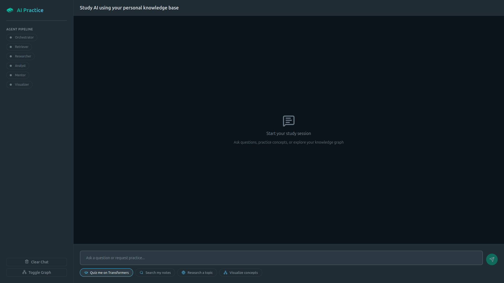
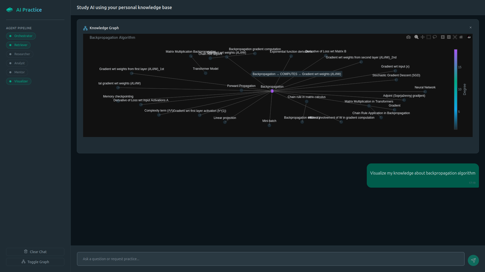
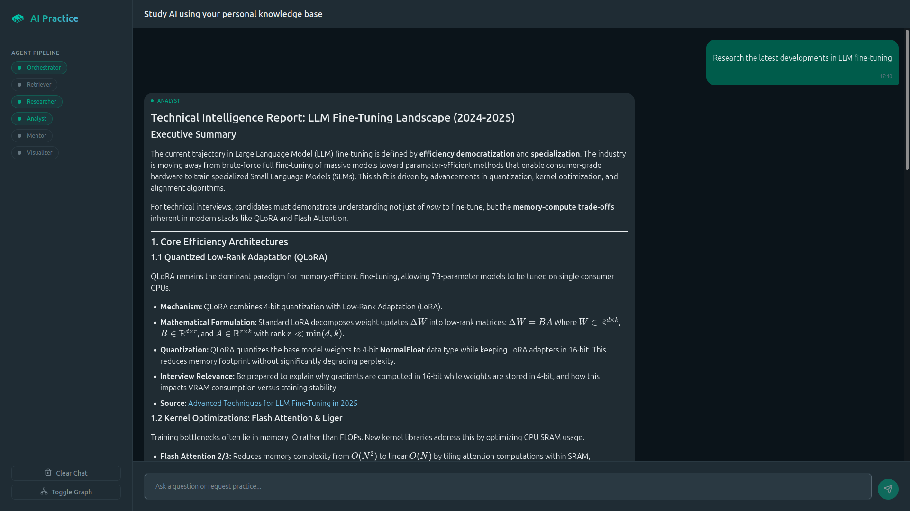
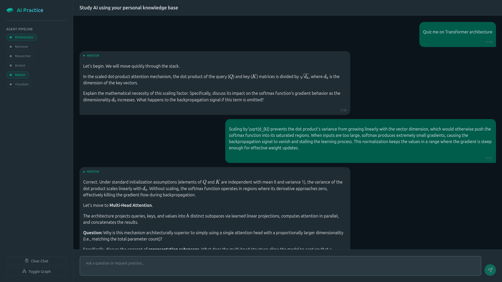

# RemNote Graph RAG | AI Practice System

[](https://www.python.org/downloads/release/python-3110/)
[](https://reflex.dev/)
[](https://developers.llamaindex.ai/python/framework/)
[](https://github.com/langchain-ai/langgraph)
[](https://cloud.google.com/run)

> An AI practice and learning system that combines knowledge graph with multi-agent workflows to help you master
> technical
> concepts through interactive learning, research, and visualization.

## [**Live Demo**](https://remnote-graph-rag-frontend-259340997119.europe-west1.run.app/)

## Overview

This project combines a backend powered by LLM with an interactive Reflex web frontend. It is built on a
personal [RemNote](https://www.remnote.com) knowledge base through the creation of a knowledge graph, which is used for
querying information and visualizing data. Internal personal knowledge can also be expanded through external web
research.

## System architecture

### Backend

The backend is built on a multi-agent workflow architecture powered
by [LangGraph](https://github.com/langchain-ai/langgraph)
and [LlamaIndex](https://developers.llamaindex.ai/python/framework/). The following agents are currently implemented:

- **Orchestrator**: Routes requests to other specialized agents
- **Retriever**: Searches for relevant information in a knowledge graph and performs reranking
- **Researcher**: Utilizes web search via [Tavily](https://www.tavily.com/) API to expand the existing knowledge base
- **Analyst**: Synthesizes and summarizes information
- **Mentor**: Answers questions and facilitates practice
- **Visualizer**: Creates visual representations of knowledge graphs

### Frontend

Web interface built with [Reflex](https://github.com/reflex-dev/reflex) framework:

- Real-time streaming responses
- Interactive graph visualizations with [Plotly](https://plotly.com/)
- Agent status monitoring

## Prerequisites

1. **Python 3.11+**
2. **Poetry** for dependency management
3. **Required services:**
    - [Ollama](https://ollama.com/library?sort=newest) server (for local LLM inference, but Ollama Cloud can also be
      used)
    - [Neo4j](https://neo4j.com/) database (for graph storage)
    - [Redis](https://redis.io/) server (for vector/document storage)
    - [Cohere](https://docs.cohere.com/docs/rerank) API key for Reranker model

## Prepare environment

1. **Ingest**: Place RemNote Markdown exports in `data.raw`.
2. **Parse**: `python scripts/parse_data.py`
3. **Index**: `python scripts/build_graph_index.py`

Both scripts will save the data to the local storage by default (the path is specified in the
`backend.configs.paths.PathSettings.local_storage_dir` parameter). See the comments in the scripts to use non-local
storage (Redis and Neo4j).

## Running the application locally

```bash
# Initialize Reflex (first time only)
reflex init

# Start the Reflex development server
reflex run

# For production deployment
reflex run --env prod
```

The application will be available at `http://localhost:3000`

## Cloud deployment

This is just one tested deployment option using [Google Cloud Run](https://cloud.google.com/run) with managed databases.
Other cloud providers and
configurations are also possible.

### Prerequisites

- [**Google Cloud Project**](https://www.google.com/url?sa=t&source=web&rct=j&opi=89978449&url=https://developers.google.com/workspace/guides/create-project&ved=2ahUKEwjprMeO476SAxXAhP0HHSpjHyEQFnoECBsQAQ&usg=AOvVaw2ZhCyP-ADTJAk5HpKkZd0W)
  with billing enabled
- [**Upstash Redis**](https://upstash.com/) for document/index storage
- [**Pinecone**](https://www.pinecone.io/) for vector storage
- **Neo4j [Sandbox](https://neo4j.com/sandbox/)/[Aura](https://neo4j.com/product/auradb/)** for graph storage

### Steps

1. **Set up cloud databases:**
    - Create Upstash Redis instance and note `REDIS_HOST`, `REDIS_PORT`, `REDIS_PASSWORD`
    - Create Pinecone account, create an index, and note `PINECONE_API_KEY`, `PINECONE_ENVIRONMENT`,
      `PINECONE_INDEX_NAME`
    - Create Neo4j Sandbox/Aura instance and note `NEO4J_URI`, `NEO4J_USERNAME`, `NEO4J_PASSWORD`, `NEO4J_DATABASE`

2. **Migrate local data to cloud databases:**
    - Update the `.env` file with your cloud database credentials. Set `REDIS_INIT_FROM_LOCAL=true`,
      `PINECONE_INIT_FROM_LOCAL=true`, and `NEO4J_INIT_FROM_LOCAL=true`.
    - Run the `scripts.migrate_to_cloud.py` script. This will migrate documents/indexes to Redis, vectors to Pinecone,
      and the property graph to Neo4j.

3. **Configure [GitHub Actions](https://github.com/features/actions):**
    - Create an Artifact Registry Docker repository in `REGION` (e.g. `europe-west1`).
    - Create service accounts for GitHub Actions and Runtime managing (or one SA for both).
    - Set up Workload Identity Federation (OIDC) for GitHub Actions and grant the GitHub Actions service account the
      permissions needed to deploy to Cloud Run and push images to Artifact Registry.
    - Configure secrets and variables. The configuration files in the `.github.workflows` directory contain suggestions
      for secret configuration. For example, there is advice to set up API keys and passwords using the GCP Secrets
      Manager.
    - The workflow in `.github/workflows/deploy.yml` builds two images and deploys two Cloud Run services:
      backend (port `8000`) and frontend (port `8080`). The frontend is statically exported at build time and served by
      Caddy.
    - The workflow in `.github/workflows/deploy-vllm.yml` creates three images and deploys three Cloud Run services. The
      first two are the same as mentioned above, and the third is a new one for hosting LLMs using the vLLM library.
      Before deploying, it's recommended to download the models and store them in a bucket from which they will be
      loaded during the deployment process. You also need to add the "run.invoker" role to the backend Runtime SA in the
      vllm service in order to allow model calls.

4. **Deploy:**
   ```bash
   git push origin main
   ```
   GitHub Actions will automatically build and deploy to Cloud Run the **basic workflow**.\
   To deploy the **vLLM workflow**, you should manually trigger it in the GitHub UI/CLI.

## Usage examples

- You may choose one of the suggested requests or ask you own question



- Visualize the knowledge from the personal knowledge graph



- Research the topic using the Web



- Get some quiz



## Future work

- Consider adding more flexible graph traversal options, perhaps a dynamic one?
- Testing! The main part of the project is missing
- Add a database to store user sessions, logs, and other data
- Fix bugs
- Improve interface
- Try [DSPy](https://github.com/stanfordnlp/dspy)?
- Add feedback gathering to further improve the prompts (e.g. XML → Markdown?)
- Add functionality to update personal knowledge graph (and RemNote?)
- Fix huge cold start
- Health checks?? 😮
- Optimize visualization agent